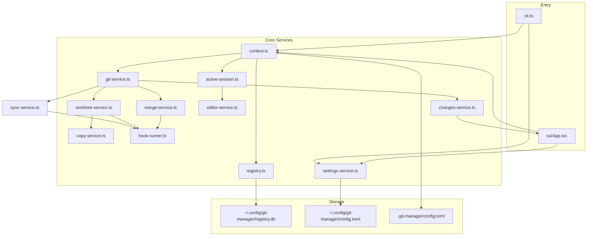
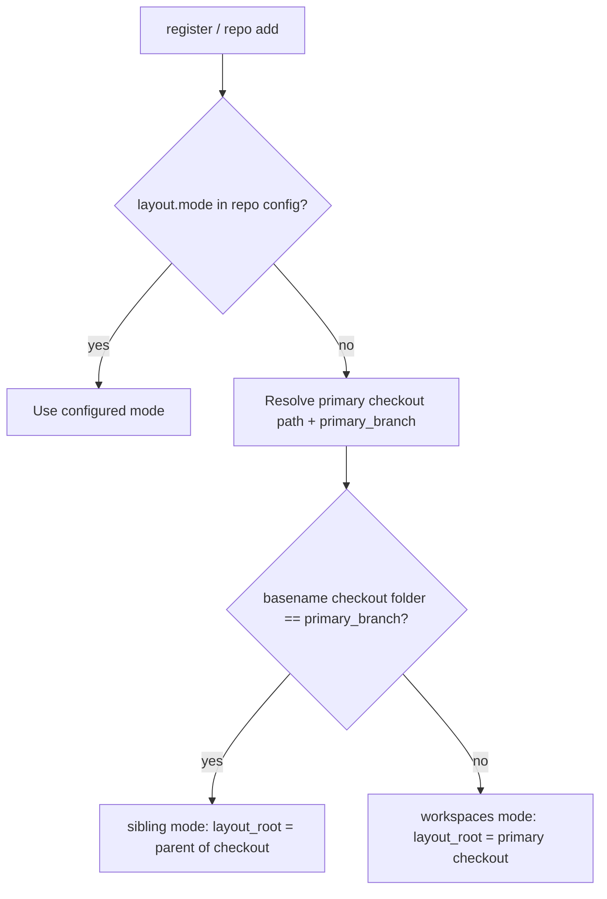
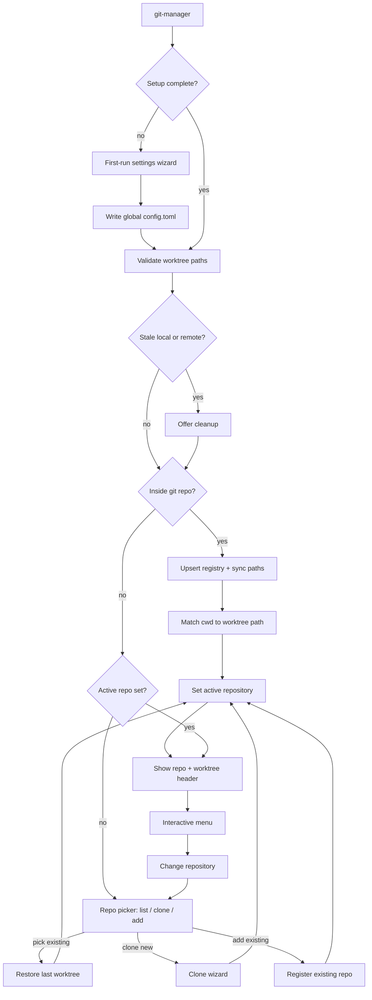
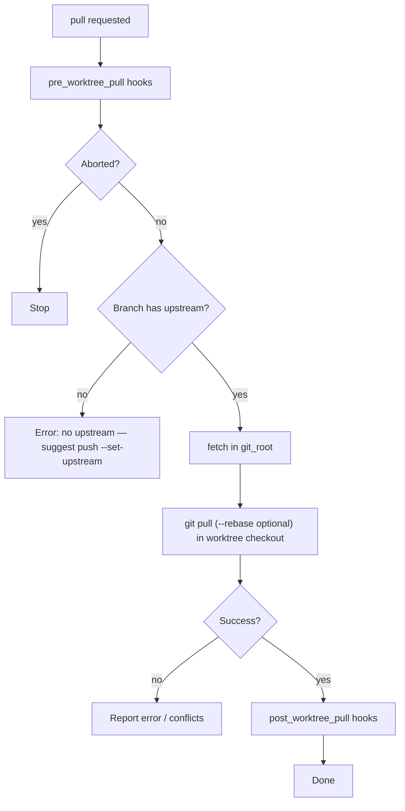
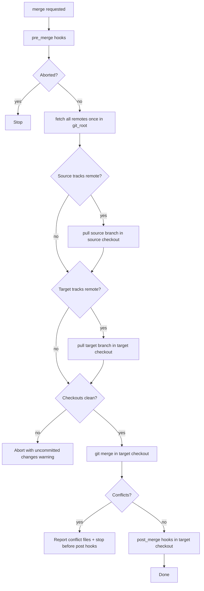
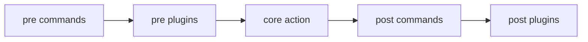

# TypeScript Git Repository Manager

## Goals

Build a local developer tool (`git-manager`) that:

1. On **first start** (no global config / setup incomplete), guides the user through essential **settings**; all settings remain editable later in the tool.
2. On launch, detects whether the current directory is inside a git repo and registers it globally, or guides the user to `**repo switch`** or clone a new one.
3. Tracks the **active repository** globally and the **active worktree** within it — switch either at any time without showing filesystem paths.
4. Shows the **current active worktree** (repo name + branch label) and lets the user **open their editor** on the selected checkout.
5. Shows **working tree changes** per worktree — staged, unstaged, untracked, renamed, deleted, and conflicted files.
6. Browses remote branches and **pushes/pulls any worktree** to sync with its upstream.
7. Creates worktrees for new or existing remote branches using one of two layout strategies.
8. Copies configured files from the main checkout into each new worktree.
9. Merges changes between worktrees and the **primary checkout** (default branch), **pulling every involved branch first when it tracks a remote**.
10. Supports **pre and post hooks** on every major action — declarative commands and/or TypeScript plugins.
11. Ships **split documentation** — a short README plus focused guides under `docs/` (use cases, configuration, plugins, etc.).

Preferred UX (from your answers): **CLI subcommands + interactive wizard when run with no args**, plus an optional **full-screen TUI** for browsing branches/worktrees. Registry lives at `**~/.config/git-manager/`**.

## Architecture




### Layering


| Layer                                                                                 | Responsibility                                                                              |
| ------------------------------------------------------------------------------------- | ------------------------------------------------------------------------------------------- |
| **CLI** (`[src/cli.ts](src/cli.ts)`)                                                  | Subcommands, default no-arg wizard via `@inquirer/prompts`                                  |
| **TUI** (`[src/tui/](src/tui/)`)                                                      | Split view: worktree list + live changes panel + contextual actions                         |
| **Changes service** (`[src/core/changes-service.ts](src/core/changes-service.ts)`)    | Parse `git status` per checkout; grouped staged/unstaged/untracked/conflict summaries       |
| **Active session** (`[src/core/active-session.ts](src/core/active-session.ts)`)       | Global active repository + per-repo active worktree; infer repo/worktree from cwd on launch |
| **Editor service** (`[src/core/editor-service.ts](src/core/editor-service.ts)`)       | Resolve editor command; spawn detached process on worktree path                             |
| **Settings** (`[src/core/settings-service.ts](src/core/settings-service.ts)`)         | Load/save global + per-repo config; first-run detection; interactive edit                   |
| **Context** (`[src/core/context.ts](src/core/context.ts)`)                            | Resolve cwd → git root, layout root, primary checkout; **infer layout mode** on register    |
| **Registry** (`[src/core/registry.ts](src/core/registry.ts)`)                         | CRUD for known repos in SQLite                                                              |
| **Git service** (`[src/core/git-service.ts](src/core/git-service.ts)`)                | fetch, list remotes/branches, clone, worktree push/pull                                     |
| **Sync service** (`[src/core/sync-service.ts](src/core/sync-service.ts)`)             | Push/pull a worktree checkout; upstream detection; set-upstream on first push               |
| **Merge service** (`[src/core/merge-service.ts](src/core/merge-service.ts)`)          | Worktree ↔ primary checkout and worktree ↔ worktree merges                                  |
| **Hook runner** (`[src/core/hook-runner.ts](src/core/hook-runner.ts)`)                | Unified pre/post hook dispatch for all actions (commands + plugins; pre can abort)          |
| **Worktree service** (`[src/core/worktree-service.ts](src/core/worktree-service.ts)`) | Path computation, `git worktree add`, `.gitignore` updates                                  |
| **Copy service** (`[src/core/copy-service.ts](src/core/copy-service.ts)`)             | Copy configured files from primary checkout → worktree                                      |


Git operations run via `**simple-git`** (wraps the real `git` binary — required for worktrees anyway). Config validated with **Zod**.

## Project Scaffolding

Initialize in `[/home/marcel/DEV/typescript/git-manager](/home/marcel/DEV/typescript/git-manager)`:

- **Runtime**: Node 20+, TypeScript 5.x
- **Build**: `tsup` → ESM bundle, `bin: { "git-manager": "dist/cli.js" }`
- **CLI**: `commander` for subcommands
- **Interactive**: `@inquirer/prompts`
- **TUI**: `ink` + `react` (terminal React; good fit for scrollable branch lists)
- **Registry**: `better-sqlite3` (sync, simple schema, no server)
- **Config**: `@iarna/toml` + `cosmiconfig` for `.git-manager/config.toml`
- Add **jiti** dependency for plugin loading
- **Tests**: `vitest` with temp git repos (use `execa`/`fs.mkdtemp`)

Suggested layout:

```
git-manager/
├── src/
│   ├── cli.ts
│   ├── commands/          # setup, settings, repo, clone, worktree, doctor, merge, ui
│   ├── core/              # services above
│   ├── config/            # schema, defaults, loader
│   ├── hooks/             # types + built-in no-op examples
│   └── tui/               # Ink split layout + panels
├── plugins/               # example user plugin (not published)
├── docs/                  # user documentation (linked from README)
│   ├── getting-started.md
│   ├── use-cases.md
│   ├── cli-reference.md
│   ├── tui-guide.md
│   ├── configuration.md
│   ├── worktrees-and-layouts.md
│   ├── plugins.md
│   └── troubleshooting.md # doctor, stale entries, plugin loading
├── README.md              # short overview + links to docs/
├── package.json
├── tsconfig.json
└── vitest.config.ts
```

## Global Registry (SQLite)

Path: `~/.config/git-manager/registry.db`

Schema (minimal v1):

```sql
CREATE TABLE repositories (
  id INTEGER PRIMARY KEY,
  name TEXT NOT NULL,
  path TEXT NOT NULL UNIQUE,        -- absolute path to layout root
  git_root TEXT NOT NULL,           -- path to primary checkout (sibling: layout/<default-branch>/)
  primary_branch TEXT NOT NULL,     -- default branch name (main, master, … from origin/HEAD)
  remote_url TEXT,
  layout_mode TEXT NOT NULL,        -- 'sibling' | 'workspaces'
  last_opened_at TEXT,
  created_at TEXT NOT NULL
);

CREATE TABLE worktrees (
  id INTEGER PRIMARY KEY,
  repository_id INTEGER NOT NULL REFERENCES repositories(id),
  branch TEXT NOT NULL,
  path TEXT NOT NULL UNIQUE,
  label TEXT,                       -- display name (defaults to branch; primary checkout uses branch name)
  is_primary INTEGER NOT NULL DEFAULT 0,
  created_at TEXT NOT NULL
);

CREATE TABLE active_sessions (
  repository_id INTEGER PRIMARY KEY REFERENCES repositories(id),
  worktree_id INTEGER NOT NULL REFERENCES worktrees(id),
  updated_at TEXT NOT NULL
);

CREATE TABLE global_state (
  id INTEGER PRIMARY KEY CHECK (id = 1),
  active_repository_id INTEGER REFERENCES repositories(id),
  updated_at TEXT NOT NULL
);
```

`register` upserts by `git_root` or layout root. On register/sync, reconcile worktrees from `git worktree list` — **every row stores absolute `path`** — and ensure a primary checkout row exists.

### Startup validation (local + remote)

On every launch (after setup), before main menu/TUI, run **worktree health check** for the active repo (and optionally all repos on `doctor` / `--all`):


| Check                                                                  | If failed                                         |
| ---------------------------------------------------------------------- | ------------------------------------------------- |
| **Local**: `path` missing on disk                                      | Offer remove from registry + `git worktree prune` |
| **Local**: path exists but not in `git worktree list`                  | Offer re-sync or unregister row                   |
| **Remote**: branch has upstream but `origin/<branch>` gone after fetch | Offer remove local worktree + registry row        |
| **Remote**: primary branch renamed on remote                           | Warn; suggest `doctor --fix` or re-register       |


Interactive prompt: *“Worktree `feature-x` — path missing. Remove from registry? [y/N]”* Batch mode via `git-manager doctor --fix`. Same checks power `doctor`; startup runs a **subset** (active repo only) with offers to cleanup.

Paths are **always stored in SQLite**; normal UI still hides them unless `--verbose` or `git-manager worktree path [label]`.

**Two-level active context:**


| Level                 | Storage                             | Behavior                                                                |
| --------------------- | ----------------------------------- | ----------------------------------------------------------------------- |
| **Active repository** | `global_state.active_repository_id` | One globally; all commands/TUI operate within this repo unless switched |
| **Active worktree**   | `active_sessions` per repo          | Last-used worktree per repo; restored when switching back to that repo  |


On launch inside a git repo: register repo → infer or load layout mode → set as **active repository** → match cwd to a worktree path → set as **active worktree** (else default to **primary checkout**).

### Layout mode detection (on register / `repo add`)

Implemented in `[src/core/context.ts](src/core/context.ts)`. Determines `sibling` vs `workspaces` when registering a repo already on disk.

**Priority:**

1. **Explicit repo config wins** — if `.git-manager/config.toml` exists at the resolved layout root and sets `[layout].mode`, use it.
2. **Otherwise infer from filesystem** (when tool is started inside a git repo):




**Rule (your requirement):** if the **primary checkout folder name** does not match the **default branch name** (`primary_branch` from `origin/HEAD` or current branch on primary worktree), treat the repo as **not sibling mode** → `**workspaces`**.

Examples:


| Primary checkout path         | `primary_branch` | Inferred mode | `layout_root`   |
| ----------------------------- | ---------------- | ------------- | --------------- |
| `~/DEV/my-app/main/`          | `main`           | `sibling`     | `~/DEV/my-app/` |
| `~/DEV/my-app/` (`.git` here) | `main`           | `workspaces`  | `~/DEV/my-app/` |
| `~/DEV/my-app/master/`        | `master`         | `sibling`     | `~/DEV/my-app/` |
| `~/DEV/my-app/develop/`       | `develop`        | `sibling`     | `~/DEV/my-app/` |


Inference uses the **primary checkout** from `git worktree list` (main worktree), not necessarily cwd — so starting inside a feature worktree still detects layout correctly.

On first inference, write `[layout].mode` to `.git-manager/config.toml` (create via `config init` if missing) so later runs do not re-guess. User can override anytime via `settings edit`.

Global `[defaults].layout_mode` applies only to **new clones**, not to inferring existing repos on disk.

**User-facing output never shows filesystem paths** — only repo name, worktree label, and branch (e.g. `my-api / feature-login (feature/login)`).

## Global User Configuration

Path: `~/.config/git-manager/config.toml` (in addition to per-repo config)

```toml
[meta]
setup_completed = true
setup_version = 1

[editor]
command = "cursor"
args = []

[hooks]
global_modules = ["setup-db.js"]   # filenames in ~/.config/git-manager/plugins/

[defaults]
# Parent directory for new clones (expanded ~); repo name appended as subfolder
clone_root = "~/DEV"
layout_mode = "workspaces"   # "sibling" | "workspaces"

[tui]
refresh_interval_ms = 2000   # auto-refresh changes in split view; 0 = manual only
```

Per-repo override optional in `.git-manager/config.toml`:

```toml
[editor]
command = "nvim"
```

Zod schema in `[src/config/schema.ts](src/config/schema.ts)`. Missing keys fall back to defaults; `**setup_completed = false**` (or missing config file) triggers first-run wizard.

## Settings and First-Run Setup

Implemented in `[src/core/settings-service.ts](src/core/settings-service.ts)` and `[src/commands/setup.ts](src/commands/setup.ts)`.

### First-run detection

First-run when **any** of:

- `~/.config/git-manager/config.toml` does not exist
- `[meta].setup_completed` is not `true`
- `[editor].command` is empty and `$EDITOR` / `$VISUAL` are unset

On first run of `git-manager` (any subcommand except `setup` / `settings`), the **setup wizard runs before** normal flow. User can skip optional steps; required step is **editor** (or confirm env fallback).

### Setup wizard steps (CLI, `@inquirer/prompts`)


| Step | Setting                    | Notes                                                                                                             |
| ---- | -------------------------- | ----------------------------------------------------------------------------------------------------------------- |
| 1    | **Editor command**         | Detect `cursor`, `code`, `nvim` on PATH; pre-fill from `$EDITOR`; validate by dry-run `--version` or accept as-is |
| 2    | **Default clone location** | Directory for new repos (e.g. `~/DEV`); create if missing; stored as `[defaults].clone_root`                      |
| 3    | **Default clone layout**   | `sibling` vs `workspaces`; sibling uses subfolder named after default branch                                      |
| 4    | **TUI refresh interval**   | ms between change refreshes; `0` = manual only                                                                    |
| 5    | **Confirm**                | Write config; set `setup_completed = true`                                                                        |


After completion, continue into normal startup (repo detect / menu / TUI).

Re-run anytime: `git-manager setup` or `git-manager settings wizard`.

### In-tool settings (always changeable)

Settings are **not** edit-only-on-disk — the tool reads/writes TOML via `settings-service`.

**CLI:**

- `git-manager settings show` — global settings (+ active repo overrides if in repo context)
- `git-manager settings edit` — interactive menu: pick setting → prompt new value → save
- `git-manager settings set <key> <value>` — dot path, e.g. `editor.command cursor`, `defaults.clone_root ~/DEV/typescript`
- `git-manager settings reset [key]` — reset key or entire global config to defaults (confirm)
- `git-manager config init` — scaffold `.git-manager/config.toml` for **active repo** (layout, copy, hooks)
- `git-manager config show` — show merged effective config for active repo (global + repo overlay)

**TUI** (`[src/tui/panels/SettingsPanel.tsx](src/tui/panels/SettingsPanel.tsx)`):

- `**S` or `,`** opens settings overlay (modal over split view)
- Tabs: **Global** | **Repository** (repo tab only when active repo selected)
- Editable fields: editor, `**defaults.clone_root`**, layout mode, TUI refresh, repo layout/copy/hooks
- Save writes TOML immediately; `Esc` cancels unsaved changes
- Link in footer: `S settings`

**Interactive menu** (default no-arg): always includes **Settings** entry.

### Config layers (merge order)

```
defaults (code) → global config.toml → per-repo .git-manager/config.toml → CLI flags
```

## Per-Repo Configuration

File: `**.git-manager/config.toml**` at the **layout root** (parent of the primary-branch folder in sibling mode, or repo root in workspaces mode). Editable via `settings edit` (repo tab), TUI settings overlay, or `config init`.

```toml
[layout]
mode = "sibling"           # or "workspaces" — if set, skips auto-detection on register
# sibling: primary checkout folder name should match primary_branch (see layout detection)
# optional override: primary_dir = "main"
workspaces_dir = ".workspaces"

[copy]
files = [".env.local", "docker-compose.override.yml"]

[hooks]
modules = ["./plugins/setup-db.ts"]   # repo-local, relative to layout root

# Global plugins (optional) — loaded for every repo; see ~/.config/git-manager/plugins/
# global_modules in global config.toml

# Each action supports optional [hooks.pre_<action>] and [hooks.post_<action>] tables.
# "commands" run via execa in the action's working directory (cwd varies by action — see Hook System).
# Plugin modules receive the same action-specific config object.

[hooks.pre_merge]
commands = ["echo Merging..."]

[hooks.post_merge]
commands = ["yarn"]

[hooks.post_worktree_create]
database_port = 5433

[hooks.post_merge.install_deps]
install_deps = true
```

**Supported hook actions** (each with `pre_`* and `post_*` config keys): `clone`, `register`, `worktree_create`, `worktree_remove`, `worktree_pull`, `worktree_push`, `merge`.

Zod schema in `[src/config/schema.ts](src/config/schema.ts)`. Missing config → sensible defaults (`workspaces` mode, empty copy list, no hook commands).

## Startup Flow (no subcommand)




Implementation in `[src/commands/default.ts](src/commands/default.ts)`. Status header in `[src/core/status-display.ts](src/core/status-display.ts)`.

## Active Repository, Worktree, and Editor

Implemented in `[src/core/active-session.ts](src/core/active-session.ts)` and `[src/core/editor-service.ts](src/core/editor-service.ts)`.

### Repository switching (unified picker)

Switch the **global active repository** at any time; the tool reloads worktrees and restores the last active worktree.

**Whenever you change repos** — `repo switch` (no args), interactive menu “Change repository”, TUI `R` — the picker always offers three paths:

```
? Repository
  ❯ * my-project
    other-api
  ─────────────────────────
    + Clone new repository…
    + Add existing repository…
```


| Action                   | Flow                                                                                      |
| ------------------------ | ----------------------------------------------------------------------------------------- |
| **Pick registered repo** | Set active → sync worktrees → restore last worktree                                       |
| **Clone new**            | URL prompt → destination (`clone_root`/repo name, editable) → clone → register → activate |
| **Add existing**         | Register a repo already on disk (see below) → activate                                    |


**CLI commands:**

- `git-manager repo list` — registered repos; `*` marks active; `--changes` for dirty summary
- `git-manager repo current` — active repository + worktree (no paths)
- `git-manager repo switch [name]` — switch repo; **with no `[name]`, opens unified picker** (list + clone + add)
- `git-manager repo switch [name] --worktree <label>` — switch repo + specific worktree
- `git-manager repo switch [name] --open` — switch + launch editor
- `git-manager repo add [--path <dir>]` — **add existing** repo to registry; default path = cwd if inside a git repo, else interactive path prompt (suggest dirs under `clone_root` that look like repos)
- `git-manager clone <url> …` — also reachable from picker; same as today
- `git-manager register` — alias for `repo add` when cwd is inside a git repo (force re-sync)

**Add existing** (`repo add`): run **layout detection** above, upsert registry (`layout_mode`, `path`, `git_root`, `primary_branch`), sync worktree paths, set as active repository, optionally pick initial worktree. Does not clone — only registers what is already there.

When cwd is inside a registered repo on any command, that repo becomes active automatically.

### Worktree selection (within active repository)

All worktrees for the **active repo** are listed by **label + branch** (primary checkout listed first):

- `git-manager worktree list` — table with `*` marking active; paths stored in registry (`--verbose` shows paths)
- `git-manager worktree path [label|branch]` — print checkout path for editor/debug (only command that shows path by default)
- `git-manager worktree switch [label|branch]` — set active worktree for current repo
- `git-manager worktree open [label|branch]` — switch (if needed) + launch editor

Default merge/pull/changes targets use the **active repository's active worktree**.

### Editor launch

`[src/core/editor-service.ts](src/core/editor-service.ts)`:

1. Resolve command: `--editor` flag → `GIT_MANAGER_EDITOR` → global `[editor].command` → per-repo override → `$VISUAL` → `$EDITOR` → fallback `code`.
2. Spawn **detached** child: `execa(command, [...args, worktreePath], { detached: true, stdio: 'ignore' })` so the CLI exits immediately.
3. Common editors work out of the box: `cursor`, `code`, `nvim`, `idea`.

Optional hook action `post_worktree_open` (declarative only in v1) for future extension — not required for initial build.

### TUI — split view (primary interface)

The TUI (`git-manager ui`) uses a **persistent split layout** scoped to the **active repository**:

```
┌──────────────────────────────────────────────────────────────────┐
│ * my-project  ·  other-api  ·  legacy-app     [R] change repo    │
│ Active: feature-x (feature/login)                                │
├─────────────────────┬────────────────────────────────────────────┤
│ Worktrees           │ Changes — feature-x                        │
│  * main        [0]  │ Staged (2)                                 │
│  > feature-x   [3]  │   M  src/app.ts                            │
│    bugfix      [1]  │ Modified (1)                               │
│                     │   M  package.json                          │
├─────────────────────┴────────────────────────────────────────────┤
│ o open · w create · x remove · p/P sync · M/m merge · S · r        │
└──────────────────────────────────────────────────────────────────┘
```

**Repository bar** (`[src/tui/panels/RepoBar.tsx](src/tui/panels/RepoBar.tsx)`):

- Shows registered repo names; `*` on active repo; compact horizontal list (scroll if many).
- `R` or `Tab` opens **repo picker overlay** — searchable list + fixed footer actions:
  - `**N`** — clone new repository (URL + destination using `clone_root`)
  - `**A**` — add existing repository (path picker; default scan `clone_root` for git repos)
  - `**D**` — unregister selected repo (confirmation, registry only)
- Selecting a registered repo: set active, restore last worktree, reload panels.

**Left pane — worktree list** (`[src/tui/panels/WorktreePanel.tsx](src/tui/panels/WorktreePanel.tsx)`):

- All checkouts with branch label; `*` = active; `[n]` = total change count badge.
- Up/down to select; selection drives the right pane (does not require switching active until confirmed).
- `Enter` on a row: set active + open editor (same as `o`).

**Right pane — changes + options** (`[src/tui/panels/ChangesPanel.tsx](src/tui/panels/ChangesPanel.tsx)`):

- **Always shown** for the selected worktree; auto-refreshes (default every 2s, configurable via global `[tui].refresh_interval_ms`).
- Groups files by status: **Staged**, **Modified** (unstaged), **Added**, **Deleted**, **Renamed**, **Untracked**, **Conflicted**.
- Up/down scroll within file list; `d` opens diff for selected file in `$PAGER` / `git diff` (optional v1).

**Keybindings** (footer hints):

- `**p`** / `**P**` — pull / push selected or active worktree
- `**w**` / `**c**` — create worktree via remote branch picker overlay
- `**x**` — remove selected worktree (confirmation)
- `**M**` / `**m**` — merge into / from **primary checkout** (default branch)
- `**o`**, `**S**`, `**r**`, `**R**` — open editor, settings, refresh, change repo

**Implementation notes:**

- Ink layout via `<Box flexDirection="row">` with fixed-width left column (~30%) and flex-grow right column.
- Changes fetched in parallel for all worktrees on each refresh tick (lightweight — `status --porcelain` only); only selected worktree renders full file list.
- Manual `r` refresh; pause auto-refresh while a blocking prompt (merge confirm) is open.

No path column in either pane (`--verbose` CLI flag only).

## Working Tree Changes (CLI)

Implemented in `[src/core/changes-service.ts](src/core/changes-service.ts)`.

Uses `git status --porcelain=v1 -uall` (and `simple-git` `statusSummary` where sufficient) per checkout path. Normalized model:

```typescript
export type ChangeKind =
  | 'staged' | 'modified' | 'added' | 'deleted'
  | 'renamed' | 'untracked' | 'conflicted';

export interface FileChange {
  path: string;
  kind: ChangeKind;
  originalPath?: string;  // renames
}

export interface WorktreeChanges {
  worktreeId: number;
  label: string;
  branch: string;
  staged: FileChange[];
  unstaged: FileChange[];
  untracked: FileChange[];
  conflicted: FileChange[];
  totalCount: number;
  isClean: boolean;
}
```

**CLI commands:**

- `git-manager changes` — changes in **active** worktree, grouped output.
- `git-manager changes --worktree <label|branch>` — specific checkout.
- `git-manager changes --all` — compact summary table: worktree label, branch, counts per category, clean/dirty flag (no paths in default output; file names only with `--files`).

**Interactive menu** includes a "Show changes" entry for active worktree; default wizard header shows dirty/clean indicator (e.g. `Active: feature-x (3 changes)`).

Merge dirty-tree guard reuses `changes-service` (`isClean` / `totalCount`) instead of ad-hoc git calls.

## Clone Layout Modes and Default Location

Clone target resolution (in `[src/commands/clone.ts](src/commands/clone.ts)`):


| Invocation                                  | Layout root (registered `path`)                                                      |
| ------------------------------------------- | ------------------------------------------------------------------------------------ |
| `git-manager clone <url>`                   | `<clone_root>/<repo-name>/` — repo name from URL (e.g. `my-app` from `…/my-app.git`) |
| `git-manager clone <url> --dir <name>`      | `<clone_root>/<name>/`                                                               |
| `git-manager clone <url> --here`            | current working directory                                                            |
| `git-manager clone <url> --path <absolute>` | explicit path (bypasses `clone_root`)                                                |


`clone_root` comes from merged config `[defaults].clone_root` (supports `~` expansion). On save/wizard: validate directory exists or **offer to create** (`mkdir -p`). After clone: register repo, set as active, run layout setup below.

Interactive clone (menu / TUI `N`): pre-fill destination as `<clone_root>/<repo-name>/`; user can edit before confirming.

### Mode A: `sibling` (primary-branch subdirectory)

User opens tool in a **project folder** that is not yet a repo — or clone lands under `**clone_root`** — and uses sibling layout. Clone detects **default branch** from `origin/HEAD` after clone:

```
~/DEV/my-project/          # layout root (= clone_root + repo name)
├── main/                  # primary checkout (folder name = default branch)
├── .git-manager/
│   └── config.toml
└── feature-x/             # worktree sibling (created later)
```

Registry stores `path = my-project`, `git_root = my-project/<default-branch>`, `primary_branch = <default-branch>`. The folder name always matches the checked-out default branch (whether `main`, `master`, `develop`, etc.). Optional `[layout].primary_dir` overrides only when needed.

### Mode B: `workspaces` (`.workspaces/` inside repo)

Default when `[defaults].layout_mode = "workspaces"`. Clone into layout root (typically `<clone_root>/<repo-name>/`):

```
my-repo/
├── .git/
├── .workspaces/
│   └── feature-x/
├── .gitignore           # auto-append ".workspaces/" if missing
└── .git-manager/config.toml
```

**Git safety**: Ignoring `.workspaces/` does **not** break worktree tracking. Git stores worktree metadata under `.git/worktrees/<id>/`, not in the ignored folder. This is a common pattern (similar to how `.git/` itself is not tracked). The name `.workspaces` does not conflict with major ecosystem tools (unlike `.vscode`, `.devcontainer`, etc.).

## Worktree Creation

Command: `git-manager worktree create <branch> [--new] [--layout sibling|workspaces]`

Steps in `[src/core/worktree-service.ts](src/core/worktree-service.ts)` (each step wrapped in hook runner — see Hook System):

1. `**pre_worktree_create`** hooks (can abort).
2. Resolve target path from layout mode + branch name (sanitize `/` → `-`).
3. If branch is remote-only: `git fetch` then `git worktree add -b <branch> <path> origin/<branch>` (or track existing).
4. If `--new`: `git worktree add -b <branch> <path>`.
5. Run **copy service**: copy each `[copy].files` entry from `git_root` → worktree (skip missing files with warning).
6. `**post_worktree_create`** hooks.
7. Record worktree in SQLite; if `--activate` (default), set as active worktree and optionally open editor (`--open`).

## Worktree and Repository Removal

- `git-manager worktree remove [label|branch]` — `git worktree remove` + drop from SQLite; refuses if dirty unless `--force`; runs `pre_worktree_remove` / `post_worktree_remove` hooks
- `git-manager repo unregister [name]` — remove repo from global registry (does **not** delete files on disk); clears `active_sessions`; clears global active repo if it was active

TUI: `**x`** on selected worktree (see split view). Repo picker overlay: `**D**` unregister repo (with confirmation).

## Registry Health (`doctor`)

`git-manager doctor [--fix]` — validate registry against filesystem and git state:


| Check                                                                  | Action                                                         |
| ---------------------------------------------------------------------- | -------------------------------------------------------------- |
| **Local**: `path` missing on disk                                      | Offer remove from registry + `git worktree prune`              |
| **Local**: path exists but not in `git worktree list`                  | Offer re-sync or unregister row                                |
| **Remote**: branch has upstream but `origin/<branch>` gone after fetch | Offer remove local worktree + registry row                     |
| **Remote**: primary branch renamed on remote                           | Warn; update `primary_branch` + `git_root` path or re-register |
| Duplicate or orphan `active_sessions`                                  | Report; `--fix` resets to primary checkout                     |
| Git worktree known but missing from DB                                 | Report; `--fix` inserts/updates from `git worktree list`       |
| Layout root moved                                                      | Report path mismatch; suggest re-register                      |
| `.git-manager/config.toml` missing                                     | Warn; offer `config init`                                      |


Run on **every startup** (active repo) with interactive cleanup offers; full scan via `git-manager doctor [--fix]`; document in `docs/troubleshooting.md`.

## Branch Browse

Remote branch discovery (no checkout side effects):

- `git-manager branch list` — fetch all remotes, list remote branches (table output)
- `git-manager branch fetch` — fetch all remotes for the active repository
- Used when creating worktrees from remote branches; separate from worktree push/pull

All branch listing goes through `[src/core/git-service.ts](src/core/git-service.ts)`.

## Worktree Push and Pull

Push/pull **any registered worktree checkout** (primary or linked worktree) to sync its **current branch** with the remote.

### Commands

- `git-manager worktree pull [label|branch]` — default target = active worktree; optional `--worktree` flag
- `git-manager worktree push [label|branch]` — default target = active worktree
- `git-manager worktree push ... --set-upstream` — push and set upstream when none exists (or prompt interactively)
- `git-manager worktree pull ... --rebase` — pull with rebase instead of merge
- `git-manager worktree pull --all` — pull every worktree in the active repo that has an upstream (skip others with info message)

Both commands run through the **pre/post hook pipeline** (`pre_worktree_pull`, `post_worktree_pull`, `pre_worktree_push`, `post_worktree_push`).

### Pull algorithm




### Push algorithm

1. `**pre_worktree_push**` hooks (can abort).
2. Resolve worktree checkout + current branch.
3. If **no upstream**: fail with hint unless `--set-upstream` (runs `git push -u origin <branch>`).
4. If **dirty** (uncommitted changes): warn but allow push (push sends commits only); optional `--strict` to block when dirty.
5. If **ahead/behind** remote: show counts before push; offer pull first in interactive/TUI mode.
6. `git push` in worktree checkout (`--force-with-lease` only via explicit `--force-with-lease` flag in v1).
7. `**post_worktree_push`** hooks.

### UX integration

- **CLI interactive menu**: "Pull worktree" / "Push worktree" for active worktree; `--all` pull variant.
- **TUI**: `p` / `P` on selected row (left pane) or active worktree; show ahead/behind badge next to worktree in list (e.g. `feature-x [3] ↑2 ↓1`).
- **Merge pre-pull** reuses the same underlying pull helper as `worktree pull` (shared code path, no duplicate git logic).

Hook cwd for push/pull: the **target worktree checkout**.

Example declarative hooks:

```toml
[hooks.post_worktree_pull]
commands = ["yarn"]

[hooks.pre_worktree_push]
commands = ["npm test"]
```

## Worktree Merge

Offer merge flows in the default interactive menu, CLI subcommands, and TUI. Implemented in `[src/core/merge-service.ts](src/core/merge-service.ts)`.

### Supported directions


| Direction               | Meaning                                           | Pull-first rule                                                          |
| ----------------------- | ------------------------------------------------- | ------------------------------------------------------------------------ |
| **into primary**        | Merge a worktree branch into the primary checkout | Pull **source** + **primary branch** in `git_root` if remote             |
| **from primary**        | Merge primary checkout into a worktree branch     | Pull **primary** in `git_root` + **target** in target checkout if remote |
| **worktree → worktree** | Merge branch A into branch B                      | Pull **both** if remote                                                  |


Commands:

- `git-manager merge into-primary [--from <label|branch>]` — default `--from` = active worktree
- `git-manager merge from-primary [--to <label|branch>]` — default `--to` = active worktree
- `git-manager merge <source> <target>` — worktree-to-worktree; rejects if target is primary checkout without using dedicated commands

### Merge algorithm

Every merge runs through the unified hook pipeline. Pull logic applies to **both source and target** branches.




**Remote detection** (in `[src/core/git-service.ts](src/core/git-service.ts)`):

- Branch tracks a remote if `git rev-parse --abbrev-ref @{upstream}` succeeds, or a matching `origin/<branch>` exists after fetch.
- Pull = `git pull` in that branch's **checkout directory** (primary checkout uses `git_root`; worktrees use their stored `path`).
- Local-only branches (no upstream, no remote ref) are skipped with an info message.

Implementation details:

1. **Resolve endpoints** via registry + `git worktree list` — map paths/branches to checkouts.
2. `**pre_merge` hooks** — declarative commands + plugins; returning `abort` or throwing `HookAbortError` cancels the merge before any pull.
3. **Pull all remote endpoints** — source first, then target (order avoids target advancing before source is fresh).
4. **Perform merge** in the **target** checkout: `merge(sourceBranch)`.
5. **Dirty tree guard** — reuse `changes-service`: refuse merge if source or target has changes unless `--force`.
6. **Conflicts** — surface file list and exit non-zero; do not run `post_merge` hooks on failure.
7. `**post_merge` hooks** — run in target checkout after successful merge.
8. **Interactive menu** — pick source/target worktrees from registry list; show which branches will be pulled.

### TUI merge actions

Actions available from the footer / when a worktree is selected in the split view:

- `M` — merge into primary checkout (confirmation; includes change counts)
- `m` — merge from primary checkout
- Dirty worktrees show warning badge in left pane before merge is offered

## Hook System (pre + post for all actions)

All major operations delegate to `[src/core/hook-runner.ts](src/core/hook-runner.ts)` using a consistent pipeline:




1. Run `**[hooks.pre_<action>].commands**` in the action's working directory.
2. Run **pre plugin methods** from `[hooks].modules` — may return `'abort'` or throw `HookAbortError` to cancel.
3. Execute the core git/service logic.
4. Run `**[hooks.post_<action>].commands`** (skipped if core action failed).
5. Run **post plugin methods**.

**Working directory per action:**


| Action                                | Hook cwd                            |
| ------------------------------------- | ----------------------------------- |
| `clone`                               | layout root (after clone)           |
| `register`                            | detected git root                   |
| `worktree_create` / `worktree_remove` | new/existing worktree path          |
| `worktree_pull` / `worktree_push`     | target worktree checkout            |
| `merge`                               | target checkout (both pre and post) |


Global flags: `--no-hooks` skips all hooks; `--no-pre-hooks` / `--no-post-hooks` for partial skip.

### Plugin interface

`[src/hooks/types.ts](src/hooks/types.ts)` — every action has matching `pre`* / `post*` methods:

```typescript
export type HookResult = void | 'abort';

export interface MergeHookContext {
  layoutRoot: string;
  gitRoot: string;
  sourcePath: string;
  targetPath: string;
  sourceBranch: string;
  targetBranch: string;
  direction: 'into-primary' | 'from-primary' | 'worktree-to-worktree';
  config: RepoConfig;
}

export interface WorktreeHookContext { /* layoutRoot, gitRoot, worktreePath, branch, config */ }
export interface CloneHookContext { /* layoutRoot, gitRoot, remoteUrl, layoutMode, config */ }
// ... RegisterHookContext, SyncHookContext, etc.

export interface GitManagerPlugin {
  name: string;
  preClone?(ctx: CloneHookContext): Promise<HookResult>;
  postClone?(ctx: CloneHookContext): Promise<void>;
  preRegister?(ctx: RegisterHookContext): Promise<HookResult>;
  postRegister?(ctx: RegisterHookContext): Promise<void>;
  preWorktreeCreate?(ctx: WorktreeHookContext): Promise<HookResult>;
  postWorktreeCreate?(ctx: WorktreeHookContext): Promise<void>;
  preWorktreeRemove?(ctx: WorktreeHookContext): Promise<HookResult>;
  postWorktreeRemove?(ctx: WorktreeHookContext): Promise<void>;
  preWorktreePull?(ctx: SyncHookContext): Promise<HookResult>;
  postWorktreePull?(ctx: SyncHookContext): Promise<void>;
  preWorktreePush?(ctx: SyncHookContext): Promise<HookResult>;
  postWorktreePush?(ctx: SyncHookContext): Promise<void>;
  preMerge?(ctx: MergeHookContext): Promise<HookResult>;
  postMerge?(ctx: MergeHookContext): Promise<void>;
}
```

`SyncHookContext` extends worktree context with `direction: 'pull' | 'push'`, `upstream`, `ahead`, `behind`.

Plugins loaded via dynamic `import()` using `**jiti**` so `**.ts` and `.js**` both work without a separate compile step.

**Load order** (all repos get global; repo config adds local):

1. `~/.config/git-manager/plugins/<file>` from `[hooks].global_modules`
2. `<layout-root>/<path>` from per-repo `[hooks].modules`

Document in `docs/plugins.md`: prefer repo-local plugins for project-specific hooks; global plugins for editor/sync tooling shared across repos.

Example plugins:

- `[plugins/setup-db.ts](plugins/setup-db.ts)` — `postWorktreeCreate`: spin up a database
- `[plugins/install-deps.ts](plugins/install-deps.ts)` — `postMerge`: run `yarn` / `pnpm install` (or rely on declarative `[hooks.post_merge].commands = ["yarn"]`)
- `[plugins/merge-guard.ts](plugins/merge-guard.ts)` — `preMerge`: block merge if tests fail

Full plugin authoring guide: `[docs/plugins.md](docs/plugins.md)`.

## Documentation

User-facing docs live in `**README.md`** (short entry point) and `**docs/**` (detailed guides) — avoid a single wall of text.

### README.md (keep brief, ~80–120 lines max)

- Project name and one-paragraph description
- **Features** — bullet list (worktrees, merge, push/pull, TUI, hooks, …)
- **Quick start** — install, first run (`git-manager`), open TUI (`git-manager ui`)
- **Documentation index** — table linking to each `docs/*.md` file
- **Development** — clone repo, `npm install`, `npm run build`, `npm test` (for contributors)
- License / link to plugin examples in `plugins/`

### docs/ structure


| File                                                             | Contents                                                                                  |
| ---------------------------------------------------------------- | ----------------------------------------------------------------------------------------- |
| `[docs/getting-started.md](docs/getting-started.md)`             | Install, first-run wizard, register/clone a repo, switch worktrees, open editor           |
| `[docs/use-cases.md](docs/use-cases.md)`                         | Scenario-based recipes: parallel features, hotfix on primary branch, post-merge `yarn`    |
| `[docs/cli-reference.md](docs/cli-reference.md)`                 | All subcommands, flags, examples (`repo switch`, `worktree pull`, `merge`, `settings`, …) |
| `[docs/tui-guide.md](docs/tui-guide.md)`                         | Split layout, keybindings (`R`, `N`, `A`, `S`, …), repo picker (switch / clone / add)     |
| `[docs/configuration.md](docs/configuration.md)`                 | Global vs per-repo TOML, `clone_root`, settings layers, hooks                             |
| `[docs/worktrees-and-layouts.md](docs/worktrees-and-layouts.md)` | Sibling vs workspaces, **auto-detection rule**, copy files, diagrams                      |
| `[docs/plugins.md](docs/plugins.md)`                             | Hook actions, global vs repo plugins, jiti TS/JS loading, examples, abort semantics       |
| `[docs/troubleshooting.md](docs/troubleshooting.md)`             | `doctor`, stale registry, plugin load errors, editor issues                               |


### In-tool pointers

- `git-manager help` / `git-manager <command> --help` — concise usage (generated from commander)
- `git-manager docs [topic]` — print path to relevant `docs/*.md` or open in `$PAGER` (optional v1 nice-to-have)
- First-run wizard final step: “Read docs/getting-started.md for more”

Docs written in Markdown only; no separate docs site in v1. Diagrams use ASCII or mermaid in the markdown files where helpful.

## CLI Command Surface


| Command                                  | Purpose                                                       |
| ---------------------------------------- | ------------------------------------------------------------- |
| `(default)`                              | Detect context, show active repo + worktree, interactive menu |
| `register`                               | Alias: `repo add` when cwd is a git repo (force re-sync)      |
| `repo list                               | current                                                       |
| `clone [--dir                            | --here                                                        |
| `branch list                             | fetch`                                                        |
| `worktree list                           | switch                                                        |
| `repo unregister [name]`                 | Remove repo from registry (files stay on disk)                |
| `doctor [--fix]`                         | Validate registry vs git/disk; optional auto-repair           |
| `changes [--worktree] [--all] [--files]` | Show staged/unstaged/untracked/conflict summary per worktree  |
| `merge into-primary                      | from-primary                                                  |
| `setup`                                  | Re-run first-run settings wizard                              |
| `settings show                           | edit                                                          |
| `docs [topic]`                           | Show/open documentation topic (getting-started, plugins, …)   |
| `config init                             | show`                                                         |
| `ui`                                     | Launch Ink TUI (includes settings overlay)                    |


## Implementation Phases

### Phase 1 — Foundation

- Scaffold package, build, tests
- `settings-service`: load/save global + repo TOML, Zod validation, merge layers
- **First-run setup wizard** + `settings` / `setup` commands
- SQLite registry + global active repo + per-repo active worktree
- Context detection + `active-session` service
- `register`, `clone`, `repo switch`, default menu + status header
- Editor service (spawn detached)

### Phase 2 — Git operations + changes + sync

- Branch list/fetch
- Worktree create/list/remove for both layout modes
- **Sync service**: worktree push/pull, upstream detection, `--set-upstream`, `pull --all`
- Ahead/behind counts for TUI badges
- Auto `.gitignore` for `.workspaces/`
- Changes service + `git-manager changes` CLI

### Phase 3 — Hook runner

- Unified pre/post pipeline for all actions
- Declarative commands + plugin loader + abort semantics
- Wire hooks into clone, register, worktree create/remove, worktree push/pull

### Phase 4 — Merge + copy

- Merge service: pull all remote source/target branches, dirty-tree guards, conflict reporting
- `merge` CLI subcommands + interactive menu entries
- Copy service (between worktree-create pre/post)
- Example plugins in repo `plugins/` + global `~/.config/git-manager/plugins/`; load via **jiti** (TS/JS)

### Phase 5 — TUI split view

- Ink split layout + repo bar / picker overlay + **settings overlay** (`S`)
- Parallel status refresh for active repo's worktrees; change count badges
- Wire actions: repo switch, worktree switch, **create** (`w`), **remove** (`x`), push, pull, open editor, merge, settings, refresh
- Share `changes-service` and other core services with CLI (no duplicated git logic)

### Phase 6 — Polish and documentation

- Error messages, dry-run flags, vitest integration tests with real `git init`/`clone` in temp dirs
- **README.md** — short overview, quick start, docs index
- `**docs/` guides** — getting started, use cases, CLI reference, TUI, configuration, layouts, plugins
- Cross-link example plugins to `docs/plugins.md`

## Key Design Decisions

- **First-run setup is mandatory once** — wizard runs when config missing/incomplete; skippable optional steps; re-runnable via `setup`.
- **Settings editable in-tool** — CLI `settings edit/set` and TUI overlay; TOML on disk is the persistence layer, not the editing UX.
- **Global registry only** (per your choice); per-repo behavior via `.git-manager/config.toml`.
- **Real git binary** via `simple-git` — worktrees and remotes are unreliable in pure-JS git libs.
- **Layout root vs git root** tracked separately so sibling mode works cleanly.
- **Layout auto-detection on register** — sibling only if primary checkout folder name matches `primary_branch`; otherwise workspaces; explicit `[layout].mode` in repo config always wins.
- **TUI is additive** — all features available via CLI first; TUI wraps the same services.
- **Plugins are local TS modules** first — keeps extension simple; npm plugin packages can come later.
- **All remote merge endpoints pulled first** — source and target branches are each pulled in their own checkout when they track a remote; local-only branches are skipped; not skippable in v1.
- **Every action has pre and post hooks** — symmetric extension points; pre hooks can abort; post hooks run only on success.
- **Merge post-hooks run in target checkout** — matches where dependencies/build artifacts belong (e.g. `yarn` after merge).
- **Two-level active context** — global active repository + per-repo active worktree; switching repo restores that repo's last worktree.
- **Active worktree is the command anchor** — merge/pull/changes default to active repo's active worktree; paths internal only (`--verbose` for debugging).
- **Repository switching includes clone + add** — unified picker everywhere (`repo switch`, menu, TUI `R`); never only a flat list.
- **Editor, not cd** — switching context means set active worktree + optionally spawn user's editor; no "print path and cd" flow.
- **Editor resolution chain** — flag → env → global config → per-repo config → `$VISUAL` / `$EDITOR` → `code` fallback.
- **Changes are first-class** — same `changes-service` powers CLI, merge guards, TUI badges, and the split-view detail panel.
- **TUI split view is the hub** — worktrees on the left, selected worktree's changes always on the right; actions contextual to selection.
- **Worktree push/pull** — explicit per-checkout sync via `sync-service`; merge pre-pull shares the same pull helper; ahead/behind shown in TUI worktree list.
- **Split documentation** — concise README + focused `docs/*.md` files; plugin guide separate from getting started.
- **Primary checkout follows default branch** — sibling layout uses a subfolder named after `primary_branch`; inference compares folder basename to branch name.
- **Registry always stores worktree paths** — startup validates local existence + remote branch presence; offers cleanup before main flow.
- **Default clone location** — `[defaults].clone_root` in global settings; wizard + `settings edit`; clones land in `<clone_root>/<repo-name>/` unless `--here` / `--path`.
- **Single repo switch command** — `repo switch` only (interactive when name omitted); no `select` alias.

## Risks and Mitigations


| Risk                                      | Mitigation                                                                                        |
| ----------------------------------------- | ------------------------------------------------------------------------------------------------- |
| Worktree path collisions                  | Sanitize branch names; check path exists before `worktree add`                                    |
| Copy overwrites tracked files in worktree | Copy only configured paths; warn on conflict                                                      |
| Merge conflicts mid-flow                  | Stop before post hooks; print `git status` guidance in target checkout                            |
| Remote pull fails before merge            | Abort merge before `git merge`; pre hooks already ran — document re-run behavior                  |
| Post-action command fails (e.g. yarn)     | Core action already succeeded — report hook failure clearly; optional `--no-hooks`                |
| Pre-hook abort vs failure                 | Abort = clean exit 0 with message; failure = non-zero with stack trace                            |
| Plugin code execution                     | Document that plugins run with user privileges; load only from explicit config paths              |
| Editor command missing or fails           | Clear error with config hint; suggest `GIT_MANAGER_EDITOR` or `~/.config/git-manager/config.toml` |
| Active worktree path deleted on disk      | Detect on sync; prompt to pick another worktree from list                                         |
| Pull conflicts during worktree pull       | Stop before post hooks; show conflict files; refresh changes panel                                |
| Push rejected / no upstream               | Clear message; offer `--set-upstream` or interactive prompt in TUI                                |
| Stale repo after switch                   | `repo switch` always syncs worktrees from git before restoring session                            |
| Missing or invalid `clone_root`           | Block clone with hint; offer `settings set defaults.clone_root …` or one-off `--path`             |
| TUI refresh load on many worktrees        | Parallel porcelain status for **active repo only**; throttle interval; pause during modals        |
| `better-sqlite3` native binding           | Pin version; document `npm rebuild` on Node upgrades                                              |


## Out of Scope (v1)

- Shell directory integration (`cd` into worktree from CLI process)
- Displaying filesystem paths in normal output (debug `--verbose` only)
- GUI / web UI
- Automatic conflict resolution / merge abort rollback
- Multi-remote merge workflows
- Published npm plugin protocol

